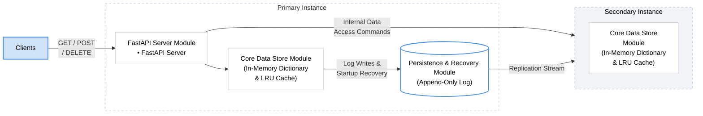

# PyKV: A Scalable Key-Value Store with Persistence

PyKV is a high-performance, in-memory key-value store designed for low-latency access, data durability, and fault tolerance. Its modular architecture enables independent scaling and benchmarking of caching, persistence, and replication..

---

## 🏗 System Architecture

The interaction between the core data store, persistence layer, and replication engine:

---

## 🧩 Core Modules

- Data Store: Hybrid DLL & HashMap for $O(1)$ access; handles LRU Eviction and TTL.
- API Layer: FastAPI with Pydantic validation and asynchronous request handling.
- Persistence: Write-Ahead Logging (WAL) with background log compaction.
- Replication: Primary-Replica model with auto-resync and health monitoring.
- Interface: Interactive CLI and Streamlit Web Dashboard for visual telemetry.
  
---

## 👤 User POV: Interactive Operations

PyKV offers a seamless experience through its Streamlit Dashboard:

- **Live Metrics:** Monitor real-time stats like hit ratio, evictions, and capacity  
- **Data Browser:** View and verify all active keys, values, and their remaining TTL 
- **Key Operations:** Perform SET, GET, UPDATE, DELETE  operations

---

## ⚖️ PyKV vs. Python Dictionary

| Feature | Python Dictionary | PyKV |
|------|------------------|------|
| Persistence | Lost on program exit | Durable; saved to disk via WAL |
| Memory Limit | Grows until RAM is full | Strict LRU eviction policy |
| Concurrency | Single-threaded access only | Thread-safe via Sharding and Shard Locks |
| Expiration | No native support | Native TTL (Time-To-Live) support |

---
## 🚀 Quick Start: Running PyKV

By default, the system initializes with **1 Leader** and **2 Replicas**. PyKV supports an unlimited number of replica nodes to ensure high availability and fault tolerance. Use the following commands to start the service:

| Command | Description |
| :--- | :--- |
| `python -m pykv --streamlit` | Launch the real-time web-based monitoring dashboard. |
| `python -m pykv --cli` | Start the interactive command-line interface. |
| `python -m pykv --streamlit --replicas 4` | Scale the cluster to 4 or more replica nodes. |

---
## 🛠 Tools & Technologies

### 🐍 Core Language & Runtime
* **Python 3.x**

### 📚 Standard Libraries
* **asyncio**
* **threading**

### 🏗 Data Structures & Algorithms
* **Doubly Linked List (DLL)**
* **HashMap (Python Dictionary)**
* **Sharded Locks**

### 🌐 Web & API Frameworks & Tools
* **FastAPI**
* **Pydantic**
* **Uvicorn**
* **requests**
* **Streamlit** (frontend)

### 💾 Persistence & Serialization
* **Append-Only Log (WAL)**
* **JSON Serialization**

### 📡 Distributed Systems
* **Primary-Replica Protocol** (Supports unlimited follower nodes)

---

## 📈 Benchmarking Results

Tests were conducted with 20 concurrent threads and 5,000 total requests.

| Metric | SET Operation | GET Operation |
|------|---------------|---------------|
| Throughput | 302.62 ops/sec | 397.12 ops/sec |
| Avg Latency | 3.30 ms | 2.52 ms |
| Success Rate | 100% | ~20%* |
| Total Time | 16.53 seconds | 12.59 seconds |

\* Note: Lower GET success rate is expected due to the cache capacity (1,000) being smaller than the total inserted keys, triggering LRU eviction.
 

---

## 🛠 Future Roadmap
- [ ] Support for advanced data types (Sets, Hashes, Lists).
- [ ] Custom binary protocol for sub-millisecond latency.
- [ ] Partition-based sharding for massive horizontal scale.

*Built for high-performance data systems.*
