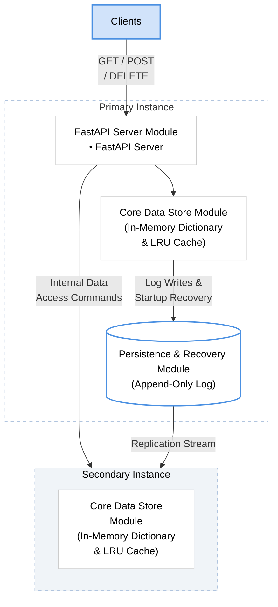

# PyKV: A Scalable Key-Value Store with Persistence

PyKV is a high-performance, in-memory key-value store designed to address core challenges in modern data systems: low-latency access, data durability, fault tolerance, and concurrent request handling.  
It follows a modular architecture, enabling independent design, testing, and benchmarking of key components like caching, persistence, and replication.

---

## 🏗 System Architecture

The following diagram illustrates the interaction between the core data store, the persistence layer, and the replication engine.

---

## 🧩 Module Explanation

### Module 1: Core Data Store
Uses a combination of a Doubly Linked List (DLL) for maintaining usage order and a HashMap for `O(1)` access.  
It enforces a strict memory usage policy via LRU eviction and supports TTL for automatic key expiration.

---

### Module 2: FastAPI Server Layer
Acts as the primary interaction layer, handling HTTP request routing, Pydantic-based input validation, and asynchronous processing to manage concurrent client requests.

---

### Module 3: Persistence & Recovery
Ensures durability by recording every change to an Append-Only Log (WAL).  
It features an asynchronous writer to prevent disk I/O from blocking requests and a background compaction process to minimize log size.

---

### Module 4: Replication
Maintains live copies of data on replica nodes using a Primary-Replica model.  
It includes a health monitor for node tracking and an auto-resync feature for recovering nodes.

---

### Module 5: Client Interface
Provides an interactive menu-driven CLI with smart failover and a real-time Streamlit web dashboard for visual monitoring and operations.

---

## 🛠 Tools & Technologies

- **Language:** Python 3.x  
- **Data Structures:** Doubly Linked List, HashMap (Dictionary)  
- **Web Framework:** FastAPI (Async handlers)  
- **Validation:** Pydantic Models  
- **GUI Dashboard:** Streamlit  
- **Data Format:** JSON (for WAL and API communication)

---

## 👤 User POV: Interactive Operations

PyKV offers a seamless experience through its Streamlit Dashboard:

- **Live Metrics:** Monitor real-time stats like hit ratio, evictions, and capacity  
- **Data Browser:** View and verify all active keys, values, and their remaining TTL  
- **Key Operations:**
  - **SET:** Add new pairs with an optional TTL for automatic cleanup  
  - **GET:** Instantly retrieve values; expired keys are treated as misses  
  - **UPDATE:** Modify values or extend expiration of existing keys  
  - **DELETE:** Manually remove entries from the store  

---

## 📡 API Endpoints

| Method | Endpoint        | Operation                          | Success Message |
|------|-----------------|------------------------------------|----------------|
| POST | `/kv/`          | Insert new key-value pair          | `{"message": "Key-Value pair set successfully"}` |
| GET  | `/kv/{key}`     | Fetch value for a key              | `{"key": "...", "value": "..."}` |
| PUT  | `/kv/{key}`     | Update existing value              | `{"message": "Key updated successfully"}` |
| DELETE | `/kv/{key}`   | Remove a key-value pair            | `{"message": "Key deleted successfully"}` |
| GET  | `/kv-items`     | List all keys, values, and TTL     | `{"items": {...}}` |
| GET  | `/stats`        | View internal engine metrics       | `{"capacity": 1000, "hits": ...}` |

---

## ⚖️ PyKV vs. Python Dictionary

| Feature | Python Dictionary | PyKV |
|------|------------------|------|
| Persistence | Lost on program exit | Durable; saved to disk via WAL |
| Memory Limit | Grows until RAM is full | Strict LRU eviction policy |
| Concurrency | Single-threaded access only | Thread-safe via Sharding and Shard Locks |
| Expiration | No native support | Native TTL (Time-To-Live) support |

---

## 📈 Benchmarking Results

Tests were conducted with 20 concurrent threads and 5,000 total requests.

| Metric | SET Operation | GET Operation |
|------|---------------|---------------|
| Throughput | 1,417.82 ops/sec | 1,607.57 ops/sec |
| Avg Latency | 14.11 ms | 12.44 ms |
| Success Rate | 100% | ~20%* |
| Total Time | 3.53 seconds | 3.11 seconds |

\* Note: Lower GET success rate is expected due to the cache capacity (1,000) being smaller than the total inserted keys, triggering LRU eviction.

---

## 🌍 Real-World Use Cases

- **Session Management:** Storing user sessions with TTL for automatic expiration  
- **Database Caching:** Fast `O(1)` access to frequently used data to reduce database load  
- **Rate Limiting:** Tracking request counts in high-concurrency environments  
